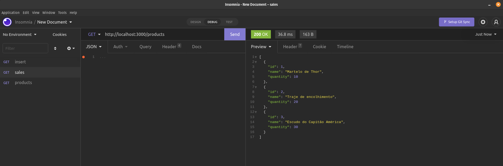

# Projeto Store Manager

## Descrição
desenvolvi minha primeira API utilizando a arquitetura MSC! trata-se de um sistema de gerenciamento de vendas, onde será possível criar, visualizar, deletar e atualizar produtos e vendas.

## Nesse projeto, mostro que sou capaz de:

Entender o funcionamento da camada de Model;
Delegar responsabilidades específicas para essa camada;
Conectar sua aplicação com diferentes bancos de dados;
Estruturar uma aplicação em camadas;
Delegar responsabilidades específicas para cada parte do seu app;
Melhorar manutenibilidade e reusabilidade do seu código;
Entender e aplicar os padrões REST;
Escrever assinaturas para APIs intuitivas e facilmente entendíveis.

## Tecnologias Utilizadas:
|Docker|Mysql|JavaScript|Node.js|
|-|-|-|-|
|||||
|ultilizado para criar o banco de dados ultilizando a imagem do mysql|foi ultilizado para criaçao das tabelas e fornecimento dos dados|Aplicação das funcionalidades|criaçao da api com Express|
___

## Melhorias:

- organizar o codigo, deixar limpo;

## imagem do projeto rodando:

